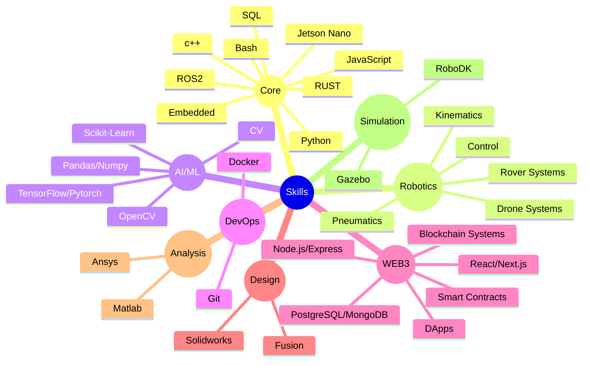

<!-- Meet -->
#  Hi, I'm Abhirup Guha Roy  

###  Engineer | Technical Coordinator @ JUMTC | Mechatronics • AI/ML • Web3 • Systems 

I'm an engineer pasionate about building intelligent systems that merge **Robotics**, **AI/ML**, **Web3**, **System Engineering** and **Simulation**.

As the **Technical Coordinator of JUMTC(Jadavpur University MEchatronics Club)**, I lead and mentor teams working on ambitious projects in **rovers**, **drones**, **ABR**, **AUV** and other intelligent platforms, driving both innovation and execution and various levels of competitions.

### ⚡ Tech Snapshot

  
  

