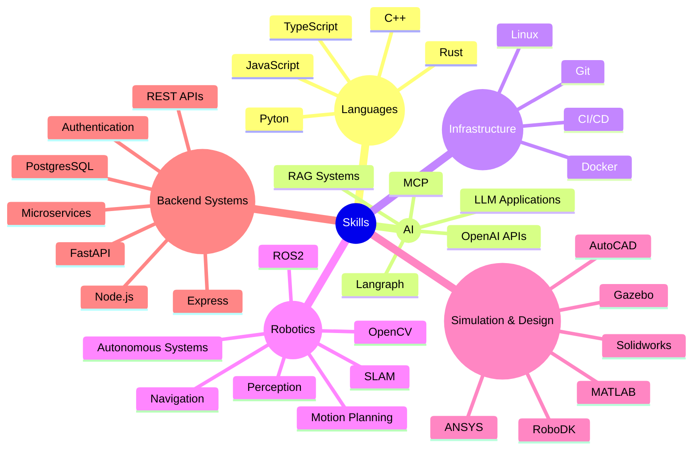

<!-- Meet -->
#  Hi, I'm Abhirup Guha Roy  

###  Robotics • AI • Backend Systems • Autonomous Navigation • Systems

I build intelligent software systems spanning robotics, AI infrastructure, backend services, and autonomous navigation. My work combines ROS2, computer vision, LLM-powered applications, and distributed systems to solve real-world engineering problems.

### ⚡ Tech Snapshot

```mermaid
mindmap
  root((Skills))
    ((Languages))
      Pyton
      TypeScript
      JavaScript
      C++
      Rust
    ((AI))
      OpenAI APIs
      RAG Systems
      LLM Applications
      Langraph
      MCP
    ((Infrastructure))
      Docker
      Linux
      Git
      CI/CD
    ((Robotics))
      ROS2
      Navigation
      SLAM
      Perception
      OpenCV
      Motion Planning
      Autonomous Systems
    ((Simulation & Design))
      RoboDK
      Gazebo
      MATLAB
      ANSYS
      Solidworks
      AutoCAD
    ((Backend Systems))
      FastAPI
      Node.js
      Express
      REST APIs
      PostgresSQL
      Authentication
      Microservices
```

  
  

